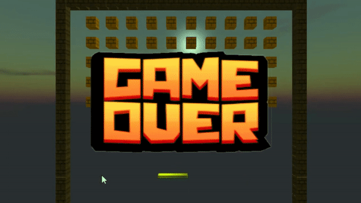
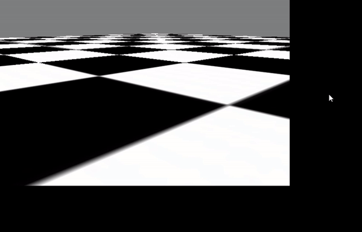
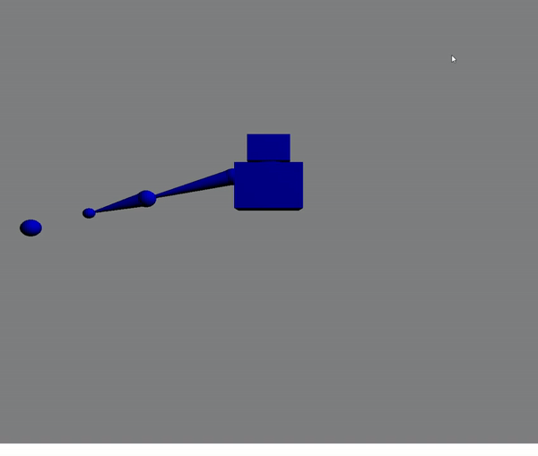
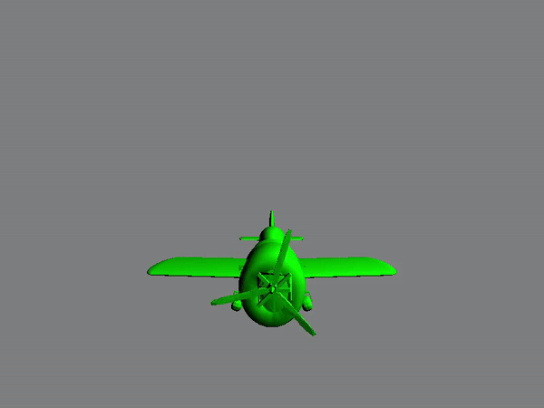

# Computer Graphics Projects

This repository contains multiple projects completed in C++ and GLSL, following the tutorials by Joey DeVries available at [learnOpenGL.com](https://learnopengl.com). These projects were done as part of the course on Computer Graphics at Trinity College Dublin.

1. Parallax Mapping
   
   
Parallax mapping is a technique used to create the illusion of depth on flat surfaces in 3D rendering. This project demonstrates the use of parallax mapping to enhance visual realism.

2. Transmittance Effects, Refraction, Chromatic Aberration, Fresnel Reflectance
   
   
This project explores various optical effects such as transmittance, refraction, chromatic aberration, and Fresnel reflectance, providing a comprehensive understanding of light interaction with materials.

3. Breakout Game
   
   
The Breakout Game project showcases the implementation of a classic Breakout game using OpenGL. It involves creating game mechanics, collision detection, and rendering.

4. Normal Mapping
   
   
Normal mapping is a technique used to add fine surface detail to 3D models without increasing their polygon count. This project showcases the application of normal mapping.

5. Phong Toon Cook-Torrance
   
   
The Phong, Toon, and Cook-Torrance shading models are fundamental in computer graphics. This project explores and compares these shading models to understand their effects on lighting in 3D scenes.

6. MIP Mapping
   
   
MIP mapping is a technique used to improve texture quality and performance in 3D rendering. This project demonstrates the concept and implementation of MIP mapping.

7. Inverse Kinematics
   
   
Inverse kinematics is a technique used to calculate joint angles to achieve a desired end effector position. This project explores and demonstrates the principles of inverse kinematics.

8. Quaternion Rotation
   
   
Quaternions are used to represent rotations in 3D space. This project explains and illustrates the concept of quaternion rotation.

