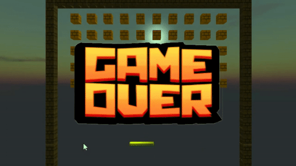
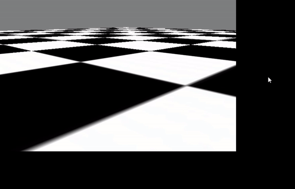
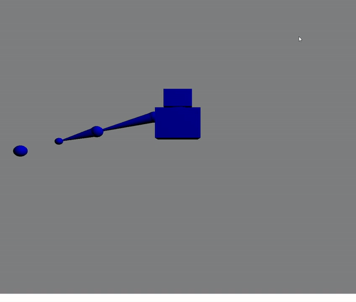

# Computer Graphics Projects

This repository contains multiple projects completed in C++ and GLSL, following the tutorials by Joey DeVries available at [learnOpenGL.com](https://learnopengl.com). These projects were done as part of the course on Computer Graphics at Trinity College Dublin.

### 1. Parallax Mapping

   
   

## Parallax Mapping

Parallax mapping is a texture mapping technique used to create the illusion of depth in flat textures. It addresses the computational expense of displacing thousands of vertices by simulating the appearance of a 3D surface on a flat model.

Parallax mapping achieves this effect by calculating shading for each point on a flat surface, making it appear higher or lower than it actually is. This calculation relies on the view direction and a depth map. For each point on the flat plane, it determines the distance under the surface based on the depth map. It then continues along the view direction into the volume for that distance. This approximation works well in most cases but breaks down at steeper viewing angles.

To improve accuracy, a more advanced technique called "steep parallax mapping" is used. It subdivides the travel distance into steps, checking the depth of the detailed surface at each step. This results in better quality but is more computationally intensive.

An even more advanced approach is "parallax occlusion mapping," which approximates the points between the correct texture points before and after hitting the surface. It is a significant improvement over basic parallax mapping, providing a closer approximation to surface detail.

In summary, parallax mapping, steep parallax mapping, and parallax occlusion mapping offer varying levels of quality and performance, making it a cost-effective way to create the illusion of depth in flat surfaces. These techniques are valuable tools in computer graphics for achieving realistic visual effects.

[Watch the Parallax Mapping Video Demo](https://youtu.be/XP7xkvDwHaM?si=TALJ3ZY6YQ_wSIkd)

### 2. Transmittance Effects, Refraction, Chromatic Aberration, Fresnel Reflectance
   
   
   
This project demonstrates various optical effects of light interacting with transparent materials such as transmittance, refraction, chromatic aberration, and Fresnel reflectance.

### 3. Breakout Game
   
   
   
The Breakout Game project showcases the implementation of a classic Breakout game using OpenGL. It involves creating game mechanics, collision detection, and rendering.

### 4. Normal Mapping
   
   
   
Normal mapping is a technique used to add fine surface detail to 3D models without increasing their polygon count by using a 2D texture to store per-fragment normals. These normals are used to modify the lighting calculations and create the illusion of depth and detail on the surface.

### 5. Phong Toon Cook-Torrance
   
   
   
Phong, toon, and Cook-Torrance shaders are techniques used in computer graphics to create stylized and non-photorealistic rendering of 3D objects. These techniques modify the way light interacts with the surface of the object to create a cartoon-like or matte appearance. 

### 6. MIP Mapping
   
   
   
MIP mapping is a technique used to improve texture quality and performance in 3D rendering. This project demonstrates the concept and implementation of MIP mapping.

### 7. Inverse Kinematics
   
   
   
Inverse kinematics is a technique used to calculate joint angles to achieve a desired end effector position. This project explores and demonstrates the principles of inverse kinematics. For more information, you can check out the project repository on [GitHub](https://github.com/liamby/OpenGL-3D-Multi-bone-Inverse-Kinematics).

### 8. Quaternion Rotation
   
   
   
Quaternions are used to represent rotations in 3D space. This project explains and illustrates the concept of quaternion rotation.

